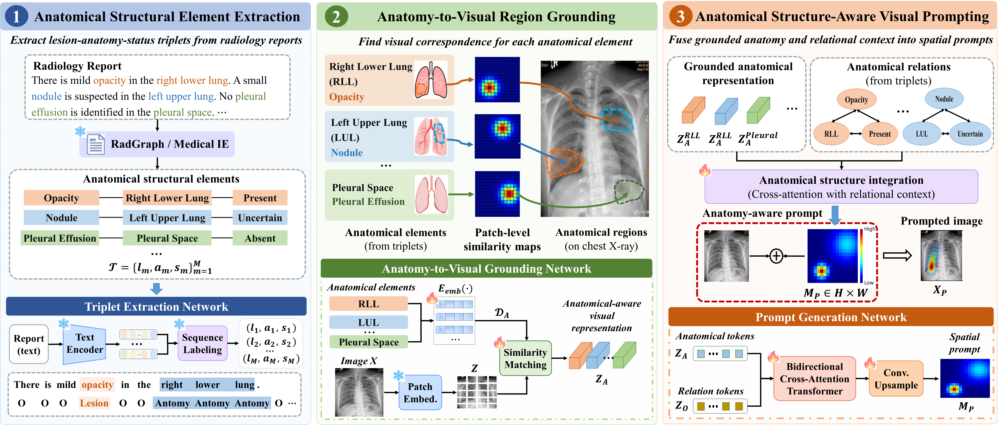

# ASVP

**Anatomical Structure-Aware Visual Prompt Learning for Medical Image Analysis**



## Abstract

Visual prompt learning provides a parameter-efficient solution for adapting pretrained models to medical image analysis. Existing approaches mainly incorporate disease semantics and general clinical information into visual prompts, but overlook anatomical structures and their relationships with visual abnormalities, limiting their spatial guidance. 
Expert-level anatomical supervision is costly and difficult to scale, while radiology reports contain rich anatomical structural elements that are expressed in an unstructured form, creating a semantic-to-visual gap that limits their direct exploitation.
To address these challenges, we propose Anatomical Structure-Aware Visual Prompting (ASVP), a radiology report-driven method for pretrained model adaptation.
Specifically, ASVP extracts lesion--anatomy--status relations from radiology reports to construct structured anatomical elements and grounds these elements in visual patch representations to generate anatomical structure-aware visual prompts. To enable image-only inference, we further introduce a knowledge distillation strategy to transfer the learned anatomical representations into report-independent representations.
Extensive experiments on multiple chest X-ray benchmarks demonstrate the effectiveness and generalization of ASVP across seen and unseen disease categories. Further analysis shows that ASVP produces more spatially focused visual representations. These results demonstrate that report-derived structured anatomical elements can support pretrained model adaptation without costly region-level expert annotations.

### Installation

To clone this repository:

```bash
git clone https://github.com/yuvaneai/RAK-PVM.git
cd RAK-PVM
```

To install the required Python dependencies:

```bash
pip install -r requirements.txt
```

### Dataset Download

We use the following publicly available chest X-ray datasets:

* **MIMIC-CXR**: We use [MIMIC-CXR-JPG](https://physionet.org/content/mimic-cxr-jpg/2.0.0/) as the chest radiographs. The corresponding radiology reports can be downloaded from [MIMIC-CXR](https://physionet.org/content/mimic-cxr/2.0.0/mimic-cxr-reports.zip).

* **ChestX-Det10**: We use [ChestX-Det10](https://github.com/Deepwise-AILab/ChestX-Det10-Dataset) as the chest radiograph dataset.

* **NIH ChestX-ray14**: We use [NIH ChestX-ray14](https://nihcc.app.box.com/v/ChestXray-NIHCC) as the chest radiograph dataset.

### Data Preprocessing

We preprocess the datasets and construct the training/test splits using the scripts provided in `data_preprocess`.

Please configure the corresponding local dataset paths before running the preprocessing scripts.

### Pre-training and Knowledge Distillation

RAK-PVM consists of report-guided pre-training followed by two report-free knowledge distillation stages for anatomy and relational knowledge.

**Reminder:** Please update the dataset and checkpoint paths in the corresponding scripts according to your local environment.

#### Pre-training

We pre-train RAK-PVM on MIMIC-CXR using:

```bash
cd pretraining_distillation/
CUDA_VISIBLE_DEVICES=0 python pretrain_module.py
```

#### Anatomy Distillation

After pre-training, we distill the anatomy-enhanced representations using:

```bash
cd pretraining_distillation/
CUDA_VISIBLE_DEVICES=0 python anatomy_distill.py
```

#### Relation Distillation

We then distill the report-derived relational knowledge into a report-independent relational prior using:

```bash
cd pretraining_distillation/
CUDA_VISIBLE_DEVICES=0 python relation_distill.py
```

The pre-training and two distillation stages are conducted for 50 epochs with a batch size of 128 on a single NVIDIA RTX PRO 6000 GPU.

### Downstream Classification

RAK-PVM supports report-free image-only inference for downstream chest X-ray classification.

**Reminder:** Please update the dataset and pretrained checkpoint paths in the corresponding downstream scripts according to your local environment.

```bash
cd downstream/
CUDA_VISIBLE_DEVICES=0 python main.py
```
# ASVP
